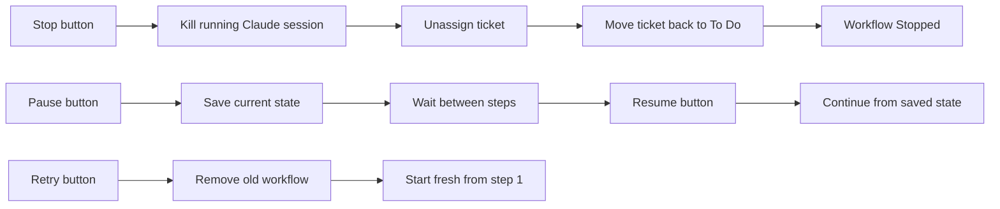

# Maestro Workflow

## Ticket Lifecycle

```mermaid
flowchart TD
    A[Jira Poller finds ticket in To Do] --> B[Assign ticket to user]
    B --> C[Move ticket to In Progress]
    C --> D[Retrieve ticket details + linked items]
    D --> E[Create git worktree from base branch]
    E --> F{pre_install configured?}
    F -->|Yes| G[Run pre_install command<br/>e.g. aws codeartifact login]
    F -->|No| H[Run install command<br/>e.g. npm ci]
    G --> H
    H --> I[Address Ticket Pass 1/3<br/>Claude Code /address-ticket]
    I --> J[PM Agent validates plan<br/>against ticket requirements]
    J --> K[Review Changes Pass 1/3<br/>Claude Code /review-changes]
    K --> L[Address Ticket Pass 2/3]
    L --> M[PM Agent validates]
    M --> N[Review Changes Pass 2/3]
    N --> O[Address Ticket Pass 3/3]
    O --> P[PM Agent validates]
    P --> Q[Review Changes Pass 3/3]
    Q --> R{Lint command configured?}
    R -->|Yes| S[Run lint]
    R -->|No| U
    S --> T{Lint passed?}
    T -->|No| S1[Claude fixes lint errors]
    S1 --> S
    T -->|Yes| S2[Commit lint fixes]
    S2 --> U{Unit test command configured?}
    U -->|Yes| V[Run unit tests]
    U -->|No| X
    V --> W{Tests passed?}
    W -->|No| V1[Claude fixes test failures]
    V1 --> V
    W -->|Yes| W1[Commit test fixes]
    W1 --> X{E2E test command configured?}
    X -->|Yes| Y[Run e2e tests]
    X -->|No| AA
    Y --> Z{E2E passed?}
    Z -->|No| Y1[Claude fixes e2e failures]
    Y1 --> Y
    Z -->|Yes| Z1[Commit e2e fixes]
    Z1 --> AA{Any steps failed?}
    AA -->|Yes| BB[Workflow Error<br/>Skip PR creation]
    AA -->|No| CC[Create PR via gh<br/>Conventional commit title<br/>Jira reference in description]
    CC --> DD[Workflow Done]

    style A fill:#1e3a5f
    style BB fill:#5f1e1e
    style DD fill:#1e5f2e
    style I fill:#2d1e5f
    style L fill:#2d1e5f
    style O fill:#2d1e5f
    style S fill:#4a3f1e
    style V fill:#4a3f1e
    style Y fill:#4a3f1e
```

## Controls

```mermaid
flowchart LR
    STOP[Stop button] --> K1[Kill running Claude session]
    K1 --> K2[Unassign ticket]
    K2 --> K3[Move ticket back to To Do]
    K3 --> K4[Workflow Stopped]

    PAUSE[Pause button] --> P1[Save current state]
    P1 --> P2[Wait between steps]
    P2 --> RESUME[Resume button]
    RESUME --> P3[Continue from saved state]

    RETRY[Retry button] --> R1[Remove old workflow]
    R1 --> R2[Start fresh from step 1]
```
