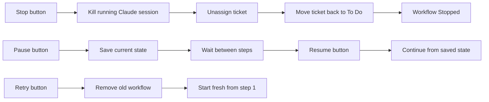

# Maestro Workflow

## Ticket Lifecycle

```mermaid
flowchart TD
    A[Jira Poller finds ticket in To Do] --> B[Assign ticket to user]
    B --> C[Move ticket to In Progress]
    C --> D[Retrieve ticket details + linked items]
    D --> E[Create git worktree from base branch]
    E --> F{pre_install commands?}
    F -->|Yes| G[Run each pre_install shell command in order<br/>e.g. aws codeartifact login]
    F -->|No| H[Run install command<br/>e.g. npm ci]
    G --> H
    H --> I[Agent steps: built-in or [[agent_steps]]<br/>Claude Code / Cursor Agent headless sessions]
    I --> J{Any step log Failed?}
    J -->|Yes| K[Workflow ends in error]
    J -->|No| L[Finalize: optional pr_url from<br/>.maestro/outcome.toml or MAESTRO_PR_URL line]
    L --> M[Workflow Done]

    style A fill:#1e3a5f
    style K fill:#5f1e1e
    style M fill:#1e5f2e
    style I fill:#2d1e5f
```

Linting, unit tests, E2E, and **opening a PR** are **not** engine steps. Encode them as **agent step prompts** (e.g. run `gh pr create`, print `MAESTRO_PR_URL: …`, or write `.maestro/outcome.toml`). The workflow **stops** when the last agent session exits successfully; Maestro then reads the optional PR URL and transitions to **Done**.

### After Done (dashboard)

- **Address PR Comments** — If a PR URL was recorded, operators can start a **secondary agent workflow** in the same worktree using **`[[review_agent_steps]]`** (same TOML shape as **`[[agent_steps]]`**; prompts may use **`{pr_url}`** plus the usual ticket placeholders). The workflow returns to **Done** when the review sequence finishes (failed steps are logged; inspect the report before re-running).
- **Mark as Done** — Transitions Jira to **`[jira] done_status`** (default `Done`), then removes the git worktree. Both steps are reported in the UI; the workflow row is removed only if **both** succeed.

## Controls


